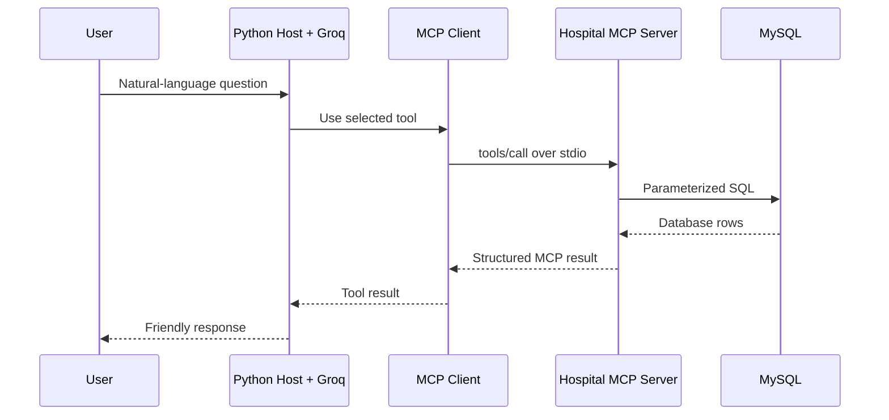

# Hospital Database Assistant using MCP

A resume-ready Python project that connects a Groq-powered hospital assistant
to a MySQL database through the official Model Context Protocol (MCP) Python
SDK.

This repository uses **synthetic demonstration records only**. It is an
educational project, not a production medical system.

## What this project demonstrates

- Official MCP client/server communication over `stdio`
- Dynamic MCP tool discovery with `list_tools()`
- MCP tool execution with `call_tool()`
- Groq local tool calling using schemas discovered from the MCP server
- Normalized MySQL tables, foreign keys, joins, indexes and transactions
- Parameterized SQL queries to prevent SQL injection
- Human approval before scheduling or cancelling an appointment
- Validation, structured errors, database audit records and unit tests

## Architecture



The LLM never connects to MySQL directly. The MCP server is the only component
allowed to execute database operations.

## Available MCP tools

| Tool | Purpose | Changes data? |
| --- | --- | --- |
| `get_patient_details(patient_id)` | Retrieve one patient | No |
| `get_lab_results(patient_id)` | Retrieve a patient's lab history | No |
| `search_doctor(specialization)` | Search active doctors | No |
| `check_medicine_stock(medicine)` | Check an exact medicine name | No |
| `schedule_appointment(patient_id, doctor_id, appointment_at)` | Create an appointment | Yes—approval required |
| `cancel_appointment(appointment_id)` | Cancel an appointment | Yes—approval required |

Two arguments intentionally differ from the original dictionary prototype:

- Scheduling uses `doctor_id` and `appointment_at` because a real appointment
  must identify both the doctor record and the time slot.
- Cancellation uses `appointment_id`, not `patient_id`, because one patient can
  have several appointments.

## Project structure

```text
hospital-mcp-assistant/
├── database/
│   ├── schema.sql          # Tables, keys and indexes
│   └── seed.sql            # Synthetic sample records
├── hospital_mcp/
│   ├── config.py           # Environment configuration
│   ├── client.py           # MCP connection, lifecycle and calls
│   ├── db.py               # Lazy MySQL connection pool
│   ├── errors.py           # Safe application exceptions
│   ├── host.py             # User UI, Groq and MCP client
│   ├── repository.py       # Parameterized SQL operations
│   ├── server.py           # FastMCP stdio server process
│   ├── tools.py            # Six registered hospital MCP tools
│   └── validators.py       # Input validation
├── tests/
├── .env.example
├── docker-compose.yml
├── mcp_host.py             # Convenience host entry point
├── mcp_server.py           # Convenience server/Inspector entry point
├── requirements.txt
└── README.md
```

## Requirements

- Python 3.11 or newer
- A Groq API key
- MySQL 8.x, or Docker Desktop

## Setup on Windows using Docker

Run these commands from Command Prompt or the VS Code terminal.

### 1. Create and activate a virtual environment

```bat
py -m venv .venv
.venv\Scripts\activate
```

PowerShell activation is:

```powershell
.\.venv\Scripts\Activate.ps1
```

### 2. Install the dependencies

```bat
python -m pip install --upgrade pip
pip install -r requirements.txt
```

### 3. Configure the environment

```bat
copy .env.example .env
```

Open `.env` and replace:

```env
GROQ_API_KEY=replace_with_your_groq_api_key
```

with your real Groq API key. Never commit `.env` to GitHub.

### 4. Start MySQL

Make sure Docker Desktop is running, then execute:

```bat
docker compose up -d
docker compose ps
```

The first start creates the database and loads `schema.sql` followed by
`seed.sql` automatically.

### 5. Start the assistant

```bat
python -m hospital_mcp.host
```

The equivalent convenience command is:

```bat
python mcp_host.py
```

The host automatically launches `hospital_mcp.server` as a subprocess,
performs the MCP initialization handshake and discovers its tools.

## Setup using an existing MySQL installation

Create the schema and sample data with a MySQL administrator account:

```bat
mysql -u root -p < database\schema.sql
mysql -u root -p < database\seed.sql
```

Create a restricted application user:

```sql
CREATE USER IF NOT EXISTS 'hospital_app'@'localhost'
IDENTIFIED BY 'replace_with_a_strong_password';

GRANT SELECT, INSERT, UPDATE
ON hospital_mcp.*
TO 'hospital_app'@'localhost';

FLUSH PRIVILEGES;
```

Update `MYSQL_HOST`, `MYSQL_USER` and `MYSQL_PASSWORD` in `.env` to match your
installation.

## Example questions

Start with these sample prompts:

```text
Show patient 101 details.
Show the lab results for patient 101.
Find a cardiology doctor.
How many Paracetamol tablets are available?
Schedule patient 102 with doctor 4 on 2030-02-20 at 10:30.
Cancel appointment 1.
```

For the last two prompts, the application displays the exact tool arguments
and asks for terminal confirmation before executing SQL.

## Test the code

The included tests do not require a running MySQL instance:

```bat
python -m unittest discover -s tests -v
```

They test argument validation, date handling, error behaviour and use of SQL
parameters.

## Test only the MCP server

The `mcp[cli]` dependency includes MCP development tools. From the project root,
you can inspect the server separately:

```bat
mcp dev mcp_server.py:mcp
```

If your installed stable SDK uses a different CLI command, check it with:

```bat
mcp --help
```

## Database design

The schema contains:

- `patients`
- `lab_results`
- `doctors`
- `appointments`
- `medicines`
- `appointment_audit`

Scheduling uses a transaction and locks the relevant rows before checking for
a doctor's time-slot conflict. Cancellation is idempotent: cancelling an
already-cancelled appointment does not create another cancellation event.

## How this differs from a custom MCP simulation

The host does not permanently type tool names into its system prompt. Instead:

1. The MCP client connects to the server.
2. `session.initialize()` performs the MCP lifecycle handshake.
3. `session.list_tools()` retrieves tool names and JSON input schemas.
4. The host converts those schemas into Groq tool definitions.
5. Groq selects a tool and arguments.
6. `session.call_tool()` sends the request to the MCP server.
7. The result is sent back to Groq for the final user-facing response.

## Security decisions

- SQL values are always passed separately from query strings.
- The host allow-lists only tools returned by the MCP server.
- Database-changing tools require user confirmation.
- Expected validation errors are returned without stack traces.
- Unexpected server errors are logged to `stderr`, not MCP `stdout`.
- The database user receives only `SELECT`, `INSERT` and `UPDATE` permissions.
- All GitHub sample records are fictional.

For a real healthcare product, additional authentication, role-based access,
encryption, consent, data-retention rules and regulatory review would be
required.

## Resume description

**Hospital Database Assistant using MCP — Python, MySQL, MCP SDK, Groq API**

- Built an MCP-based hospital assistant that translates natural-language
  requests into validated database tool calls.
- Designed a normalized MySQL schema and implemented parameterized queries,
  joins, transactions, foreign keys and audit logging.
- Exposed six operations through an official MCP server and dynamically
  discovered them from a custom Groq host/client.
- Added input validation, conflict detection, structured error handling and
  human approval for database-changing operations.

Only place these points on your resume after you have run the project and can
explain each part in an interview.

## Troubleshooting

### `Configuration error: GROQ_API_KEY is missing`

Copy `.env.example` to `.env` and add a valid key.

### MySQL connection refused

Check:

```bat
docker compose ps
docker compose logs mysql
```

Confirm that `.env` uses port `3306` and that another MySQL process is not
already using that port.

### MySQL access denied

Make sure the username and password in `.env` match the Docker Compose values
or your manually created MySQL account.

### Database changes do not appear after editing SQL files

Docker initialization scripts run only when the data volume is first created.
For this demonstration project, reset the local container and volume with:

```bat
docker compose down -v
docker compose up -d
```

This deletes the local demonstration database and recreates it from the seed
files.
